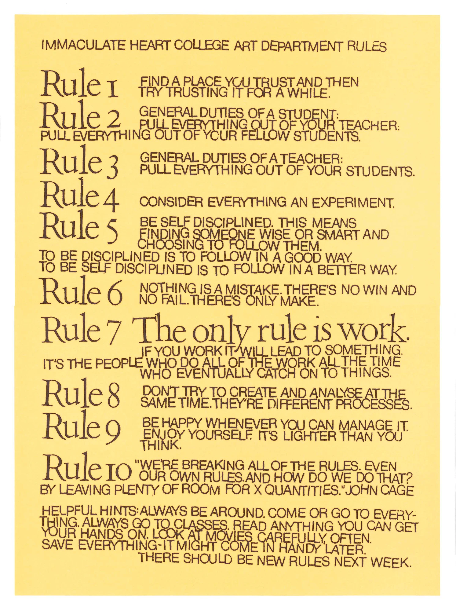

# Syllabus: Soft Object

## Instructors

**Laura Devendorf**  
Assistant Professor, ATLAS Institute & Dept. of Information Science  
laura.devendorf@colorado.edu  
Responsible for grading, participation and course administration.

**Sasha De Koninck**  
PhD student, Intermedia Art, Writing, and Performance  
Sasha.DeKoninck@colorado.edu  
Responsible for in class critiques, instruction, grading input, feedback. 

## Location and Timing 

In person location: ATLAS 113  
Zoom location: see Canvas

## Hybrid Instruction Details

Students will have the option to attend some in person sessions or take the course entirely online. In person sessions will be held particularly for class presentations and/or material demonstrations and will be limited in the amount of students depending on room size. In the event there are more students who wish to attend in person than the room can support, we will alternate in-person days between students \(half students for one week, half students the other\). The class has been designed to facilitate making and documenting in an entirely remote fashion. 

Online videos will take place at class time and will not be recorded for later viewing. 

## Course Description

This course will introduce students to techniques for designing and fabricating so-called "smart" textiles \(fabrics that have the components for sensing and actuation integrated into their structure\). With applications from soft robotics to medicine to fashion, the class will cover the state of the art from both engineering and art perspectives and will guide students through projects realizing their own interactive textile prototypes from design through fabrication. Students are encouraged to have completed basic electronics courses \(Object or experience programming and making projects with Arduino\) and while initial experience with textile fabrication is helpful, it is not required.   

### **Course Objectives:**

**Students who successfully complete this course will:**

* Understand the fundamental structures, processes, and dynamics for smart textiles. 
* Understand pattern languages for textiles and circuitry
* Learn how to use state of the art fiber-based "smart" materials
* Partake in a design methodology of materials-led research. 
* Learn a deeper sense of the gendered legacies of textiles innovation and its critical yet marginalized history in technical innovation.

\*\*\*\*

**Guiding Principles \(for life\) But Also This Class:** 

## **Course Schedule**

**Weeks 1-8: Process // Substrate**  
The first eight weeks of the course will focus on textile "substrates" or particular structures, materials and techniques common to textile design and craft. We will guide you through a materials-led design process to discover new functionalities by combining textile structures, fibers such as wool and cotton, conductive materials and/or bio materials.  Your midterm will emerge from your weekly investigations in this first module and will consist of a swatch that demonstrates and refines a functionality you have discovered.   

**Week 8-15: Application // Integration**  
The last half of the course will be devoted to integrating your midterm swatch into an application. Here we will focus on how to embed your textile swatches into more complex forms and/or different circuitry structures. Your final will be a refined prototype that demonstrates this new application. 

We will meet at our assigned finals slot for a final critique. 

## Course Materials \(to be updated\)

### Prototyping Materials

All students will be given access to a materials kit that they can use for their projects this semester. Depending on where each interest and process progresses, the Instructors may be able to lend you additional equipment and resources. The course has been designed under the assumption that everyone can work remotely, but students may need to come to campus to obtain their materials.  

Documentation will be a critical part of the class, so you may want to invest in a tri-pod or stationary mount for your smart phone or other camera, a macro lens \(for your phone or other camera\), and a quality set of lighting for photography. If you are having trouble obtaining these items, let the instructors know and we can help you.    

### Reading Materials

All reading materials for the course will be provided by the instructors. With so many resources available on the internet, we are relying on students to begin from our resources but begin their own pathways of inquiry.  

## **Grading Rubric & Assignment Types**

| Assignment Type | Percentage of Grade |
| :--- | :--- |
| Weeklies | 35% |
| Final Project | 25% |
| Midterm Project | 20% |
| History Of... | 5% |
| Participation | 15% |

**Weeklies** 

Weeklies are weekly assignments that consist of prompts for you to explore the course topic of the week. We ask each student to document their progress of investigation and submit it for grading using a template we will provide.   

**History Of**

This is a one time, 15 minute presentation  that you will give to the class to investigate the history of a particulate technique, structure, process or material that you choose. We will determine your assigned date and topic for this assignment in the second week of the semester.  ****

**Midterm** 

Your midterm will consist of developing and documenting a smart textile swatch. 

 **Final**

Your final project will consist of an application or object in which your midterm swatch is embedded. 

**Participation**

Because this is a small class, participation will be measured by your involvement in lectures \(in person and/or online\). We expect all students to attend any virtual classes with video's on and to be actively engaged in discussions and/or show and tells. 

**Attendance** 

All students will have 2 absences excused automatically. Any additional absences and make up points will need to be coordinated with the instructor. ****  

## **Research Activities**

This course has been developed as part of a larger grant studying smart textiles collaboration. In week two, the instructor or one of her students will describe how research will take place in the class and give you the opportunity to opt into or out of those research activities. Your participation in the research activities will have no effects on your grade.   

## **Contacting Prof. Devendorf**

I  prefer that students utilize my office hours with questions or comments about the class. Please send all email inquiries to laura.devendorf@colorado.edu. Please also put “\[**SO**\]” in the subject line so that I can easily recognize and respond to your email. I will do my best to respond to emails within one “business” day. For instance, if your message is sent during a regular school day \(weekday/non-holiday\), I will do my best to get back to you by the next regular school day. Due to my parenting duties, I check my email infrequently in the evenings and weekends. If you email me the night before an assignment is due, I am unlikely to be able to respond in time.

## **Additional Policies**

### **Accommodation for Disabilities**

  
****If you qualify for accommodations because of a disability, please submit your accommodation letter from Disability Services to your faculty member in a timely manner so that your needs can be addressed.  Disability Services determines accommodations based on documented disabilities in the academic environment.  Information on requesting accommodations is located on the [Disability Services website](http://www.colorado.edu/disabilityservices/students). Contact Disability Services at 303-492-8671 or dsinfo@colorado.edu for further assistance.  If you have a temporary medical condition or injury, see [Temporary Medical Conditions](http://www.colorado.edu/disabilityservices/students/temporary-medical-conditions) under the Students tab on the Disability Services website.

### **Classroom Behavior**

Students and faculty each have responsibility for maintaining an appropriate learning environment. Those who fail to adhere to such behavioral standards may be subject to discipline. Professional courtesy and sensitivity are especially important with respect to individuals and topics dealing with race, color, national origin, sex, pregnancy, age, disability, creed, religion, sexual orientation, gender identity, gender expression, veteran status, political affiliation or political philosophy.  Class rosters are provided to the instructor with the student's legal name. I will gladly honor your request to address you by an alternate name or gender pronoun. Please advise me of this preference early in the semester so that I may make appropriate changes to my records.  For more information, see the policies on [classroom behavior](http://www.colorado.edu/policies/student-classroom-and-course-related-behavior) and the [Student Code of Conduct](http://www.colorado.edu/osccr/).

### **Honor Code**

All students enrolled in a University of Colorado Boulder course are responsible for knowing and adhering to the Honor Code. Violations of the policy may include: plagiarism, cheating, fabrication, lying, bribery, threat, unauthorized access to academic materials, clicker fraud, submitting the same or similar work in more than one course without permission from all course instructors involved, and aiding academic dishonesty. All incidents of academic misconduct will be reported to the Honor Code \(honor@colorado.edu\); 303-492-5550\). Students who are found responsible for violating the academic integrity policy will be subject to nonacademic sanctions from the Honor Code as well as academic sanctions from the faculty member. Additional information regarding the Honor Code academic integrity policy can be found at the [Honor Code Office website](https://www.colorado.edu/osccr/honor-code).

### **Sexual Misconduct, Discrimination, Harassment and/or Related Retaliation**

The University of Colorado Boulder \(CU Boulder\) is committed to fostering a positive and welcoming learning, working, and living environment. CU Boulder will not tolerate acts of sexual misconduct intimate partner abuse \(including dating or domestic violence\), stalking, protected-class discrimination or harassment by members of our community. Individuals who believe they have been subject to misconduct or retaliatory actions for reporting a concern should contact the Office of Institutional Equity and Compliance \(OIEC\) at 303-492-2127 or cureport@colorado.edu. Information about the OIEC, university policies, [anonymous reporting](https://cuboulder.qualtrics.com/jfe/form/SV_0PnqVK4kkIJIZnf), and the campus resources can be found on the [OIEC website](http://www.colorado.edu/institutionalequity/).

Please know that faculty and instructors have a responsibility to inform OIEC when made aware of incidents of sexual misconduct, discrimination, harassment and/or related retaliation, to ensure that individuals impacted receive information about options for reporting and support resources.

### **Religious Holidays**

Campus policy regarding religious observances requires that faculty make every effort to deal reasonably and fairly with all students who, because of religious obligations, have conflicts with scheduled exams, assignments or required attendance.  Please contact me via email or office hours by the end of the second week of the course with specific dates that present conflicts so that I have an opportunity to make systemic adjustments to the course requirements that will benefit all students. See the [campus policy regarding religious observances](http://www.colorado.edu/policies/observance-religious-holidays-and-absences-classes-andor-exams) for full details.

### Requirements for COVID-19 

As a matter of public health and safety due to the pandemic, all members of the CU Boulder community and all visitors to campus must follow university, department and building requirements, and public health orders in place to reduce the risk of spreading infectious disease. Required safety measures at CU Boulder relevant to the classroom setting include: 

*  maintain 6-foot distancing when possible, 
* wear a cloth face covering \(over nose and mouth\), especially when unable to maintain a distance of at least 12 feet, 
* clean local work area, 
* practice hand hygiene, 
* follow public health orders, and 
* if sick and 

  * you live off campus, do not come onto campus \(unless instructed by a CU Healthcare professional\), or 
  * you live on-campus, please alert [CU Boulder Medical Services](https://www.colorado.edu/healthcenter/coronavirus-updates/symptoms-and-what-do-if-you-feel-sick). 

Students who fail to adhere to these requirements will be asked to leave class, and students who do not leave class when asked or who refuse to comply with these requirements will be referred to [Student Conduct and Conflict Resolution](https://www.colorado.edu/sccr/). For more information, see the policies on [COVID-19 Health and Safety](https://www.colorado.edu/policies/covid-19-health-and-safety-policy) and [classroom behavior](https://www.colorado.edu/policies/student-classroom-course-related-behavior) and the[ Student Code of Conduct](https://www.colorado.edu/sccr/). If you require accommodation because a disability  prevents you from fulfilling these safety measures, please see the “[Accommodation for Disabilities](./#accommodation-for-disabilities)” statement on this syllabus. Before returning to campus, all students must complete the [COVID-19 Student Health and Expectations Course](https://www.colorado.edu/protect-our-herd/how#anchor1). Before coming on to campus each day, all students are required to complete a [Daily Health Form](https://www.colorado.edu/protect-our-herd/daily-health-form).  

Students who have tested positive for COVID-19, have symptoms of COVID-19, or have had close contact with someone who has tested positive for or had symptoms of COVID- 19 must stay home and complete the [Health Questionnaire and Illness Reporting Form](https://www.colorado.edu/protect-our-herd/daily-health-form) remotely. In this class, if you are sick or quarantined, please notify Professor Devendorf within 2-days of your illness so we can modify assignment deadlines and determine if it is possible for you to attend the lecture remotely. 

## **Acknowledgements**

Thank you Sasha de Koninck for her time and effort developing the course and the many online resources.  

