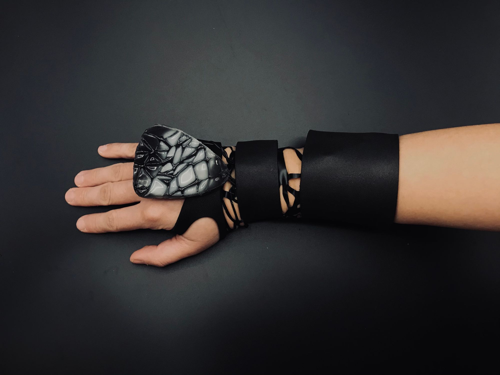
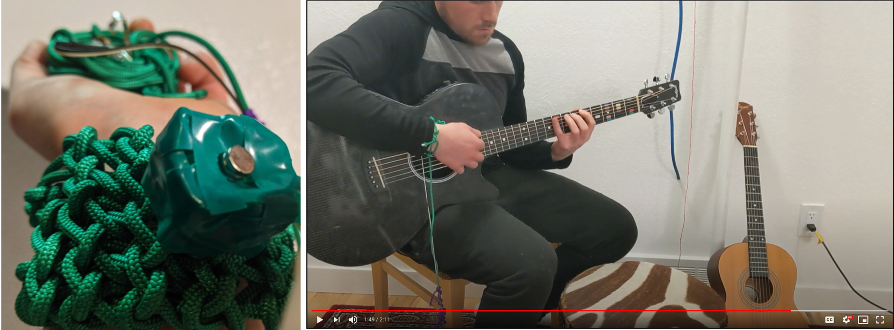
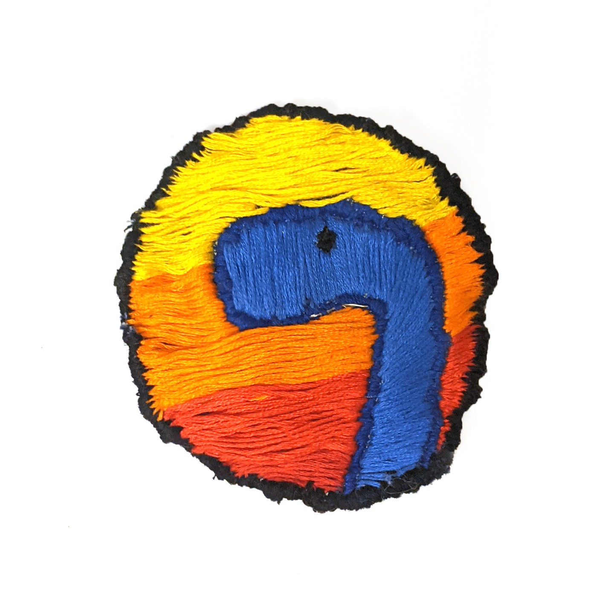
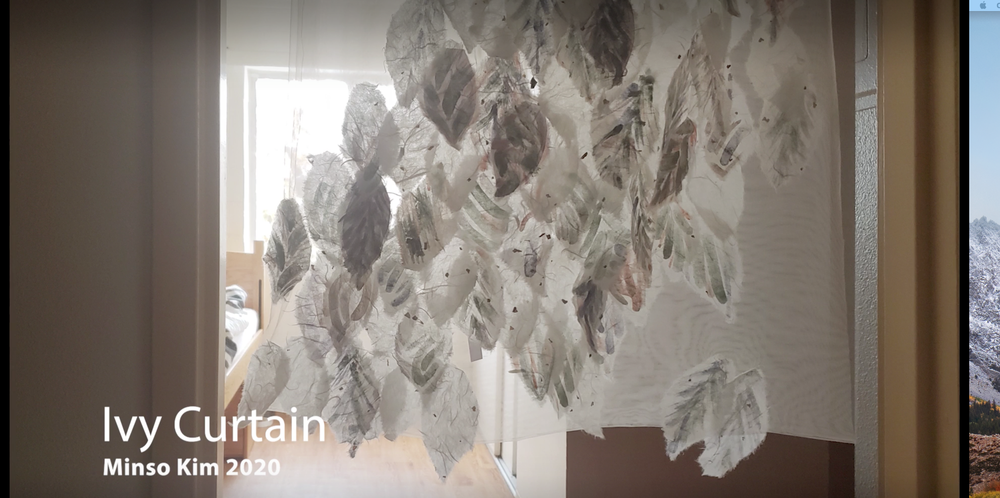
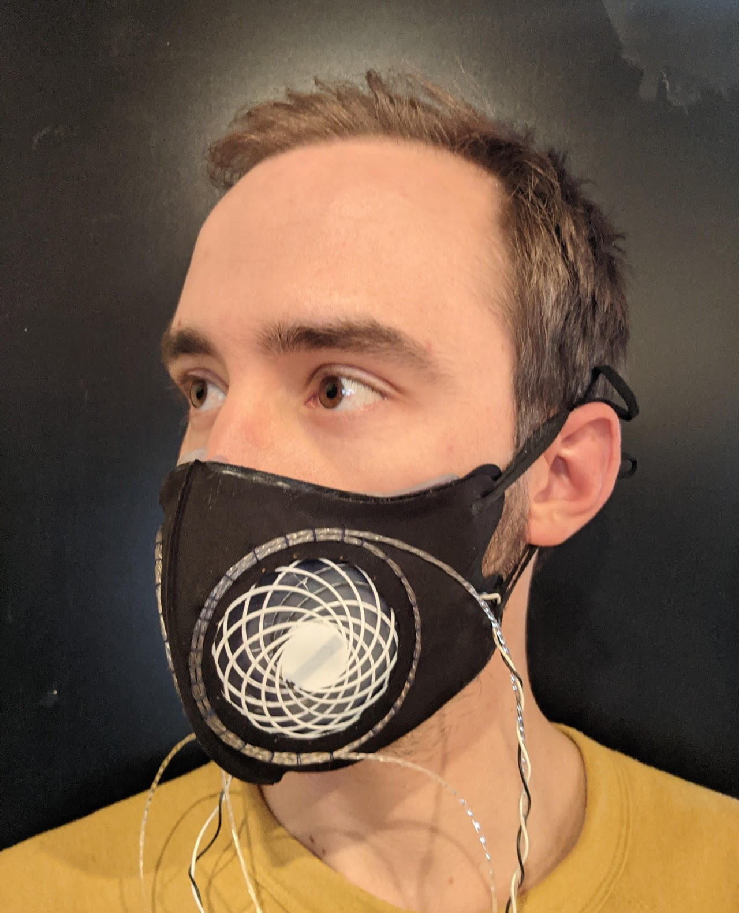
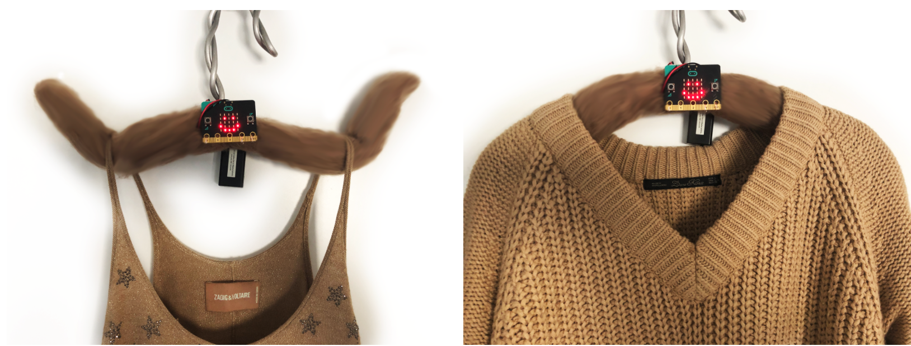
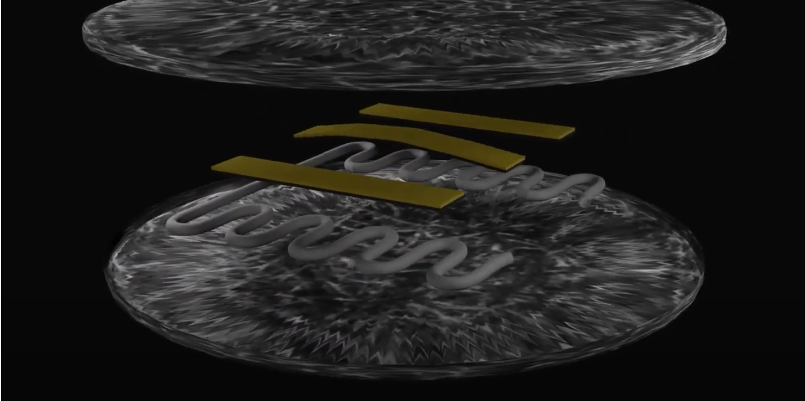

# Student Projects

**Betularia  
Mary Etta West and Sandra Bae**    
Input: Galvanic Skin Response, Heart Rate  
Output: Woven Haptics, Color Changing EcoFlex  
Documentation: [ Color Changing Cell](https://www.notion.so/BETULARIA-ae5ae56c0f8545bba3f62ebecd0a9647), [Sensing and Haptics](https://docs.google.com/presentation/d/1-qNiOIipG7SvYYIAmlqg33YYvhjgppMWZ3pcfFzqvf0/edit#slide=id.p1), [Github](https://github.com/ADataDate/Betularia)

  
**Transient Tapestry  
Fiona Bell**  
Input: People, Nanocoatings, Natural Dyes, Time, Light  
Output: Tapestry with Changing Pattern  
Documentation: [Project Webpage](https://www.fionaabell.com/transient-tapestry-details)

**Electrifying Non-conductive String:  
The String Sheath & The Soft Pick-Up  
Torin Hopkins**  
Input: Strings, Magnetism  
Output: Sonic Vibes  
Documentation: [Video](https://drive.google.com/file/d/18-o9E6X_t3Oxjkpr5OljeJpX9BRtQx9Z/view), [PDF](https://drive.google.com/file/d/1FZ8uHKmOobvAMkzVBNH-etUSpv_tDsTK/view?usp=sharing)

**Wearable Thermocouple  
Casey Hunt**  
Input: Temperature Gradient  
Output: Measurement and Sound  
Documentation: [Description and Instructions](https://casey-l-hunt.medium.com/wearable-thermometer-91bb889cc52a)

**Ivy Curtain  
Minso Kim**  
Input:  Shape Memory Alloy, Thermochromic Watercolor, Paper  
Output: Shape and Color change  
Documentation: [Description and Instructions](https://korkimminso.wixsite.com/minso/moving-ivy)



**Fidget Sweater  
Annika Muehlbradt**  
Input:  Fidgeting with Knit Bobbles  
Output: Shape Change, Color Change  
Documentation: [Description and Instructions](https://www.annika.co/fidget-sweater)

**Weaving as a Scaffold for Molding Kombucha  
Netta Ofer**  
Input: Yarn, Kombucha Scoby  
Output: Sculpture  
****Documentation: [Description and Instructions](https://drive.google.com/file/d/1AhdFjJA3rhYFa-l9tiyedxyEz5aBcujF/view?usp=sharing)

**Dynamask  
Colin Smith**  
Input: Breath  
Output: Shape Change, Exhale Rate Data   
****Documentation: [Description and Instructions](https://sites.google.com/colorado.edu/dynamask2020atls/home?pli=1&authuser=2)

**The Happy Hanger  
Liza Toklin**  
Input: Garment \(Felted Pressure Sensor\)  
Output: Data Display Change  
****Documentation: [Description and Instructions](https://softobjects.myportfolio.com/final)

\*\*\*\*

**Coffee Toaster  
Destin Woods**  
Input: Heat  
Output: Shape Change via Bimetallic Strips  
****Documentation: [Description and Instructions](https://drive.google.com/drive/u/0/folders/1B6zzIFswDfvCjCOW1fc21AmLyottDHHD), [Video](https://www.youtube.com/watch?v=UiEOrRHc5CI&feature=youtu.be)

