# Weeklies Template

Each weekly will give you a prompt and a technique to use. In your assignment turn turn in, you'll will describe what you did. This template is about process. Process means the journey you follow when attempting an assignment, not just the ending point. All the things that you do that go well, inspire a next step, or go not as you planed and either cause you to change your direction. All these experiences are equally valuable as long as we document and share them with each other. To borrow, again, from Corita Kent's rules for an art studio, "the only rule is work". With that in mind, we want you to submit the following for each of your weeklies: 

## Template

Weekly Name  
Your Name  

### What are you Setting Out to Do?

Before you start working, tell us where you are starting: Give us a 2-3 sentence description of what you think you might try and/or draw us a diagram of what you are going to make.  Your description may include responses to any of the following: describe materials you'll play with and why you chose those materials, if you have an idea of what you want to make, describe your vision. Describe what would you want to come out of this assignment and how would it be valuable to you? Did something in the reading inspire you? Did something you saw in the world give you an idea? _Spoiler Alert, you will likely not get what you envision, and that's the fun of it. Sometimes you just need a place to start but be generous and let yourself wander as new ideas come to mind._ 

### Process Notes

Its critical to make observations and take time while you are exploring materials and techniques. We want to submit a collection \(at least three, but more are welcome\) of your notes on process. Each note should include a photo and an observation or idea that emerged. 

### Reflection: 

A weekly that is generative would give you lots of ideas that you'd want to explore if you had the time. It would fuel visions of new things you'd like to make. A non-generative assignment might leave you feeling a bit blah, like you don't feel like you really got much from the processes or you are feeling much more limited in what you think you might do next. Write 2-3 sentences reflecting on what you learned about the materials, how generative those findings were in your own creative process. 

## Grading Rubric

Rather than marking down, we'll calculate grades by adding up what the assignment did well.  We expect each student to spend at least 3 hours on each weekly. The scores on each weekly will range from 0-10.

| Item | Max Point Value |
| :--- | :--- |
| **Execution**: All parts of the template were turned in and showed a good faith effort in their process and findings.  | +3  |
| **Quality**: Documentation is of high quality and provide evidence to support the findings. | +3 |
| **Writing**: The written descriptions are clear and effectively describe the value of the findings gleaned  | +2 |
| **Engagement**: The assignment demonstrates engagement in the course and its materials and/or external resources. All references to course materials and outside references are cited and/or linked | +2 |

##  Example Weekly \(Blog Format\)

_one of us should provide an example here of a weekly that earns 10 points. It should be really specific about the findings and the photos captured._ 

Laura Devendorf  
Sample Weekly

**Vision**: I got these new yarns, paper and fern silk and things, and I am wondering what to make with them. I'm thinking something to do with sound and texture. Since I had some left over warp on the loom, I stared by just playing with the paper yarns and seeing how they pack and shape and then choosing my next step from there. 

**Process Note 1:** The paper seems to pack and expand to whatever space its given. Specifically, in a tight weave it packs down. I chose to weave it with a basket weave structure just to give it a little more room. I then expanded out to larger basket weaves to see how it might "bloom" and then also doubled up the passes to make the rows a bit thicker. Between each row I threw thin tensel to keep the overall structure in tact. I began to enjoy the feel of the tests as a kind of tapestry, and decided that I should not just sample, but try to make something with an interesting aesthetic. 

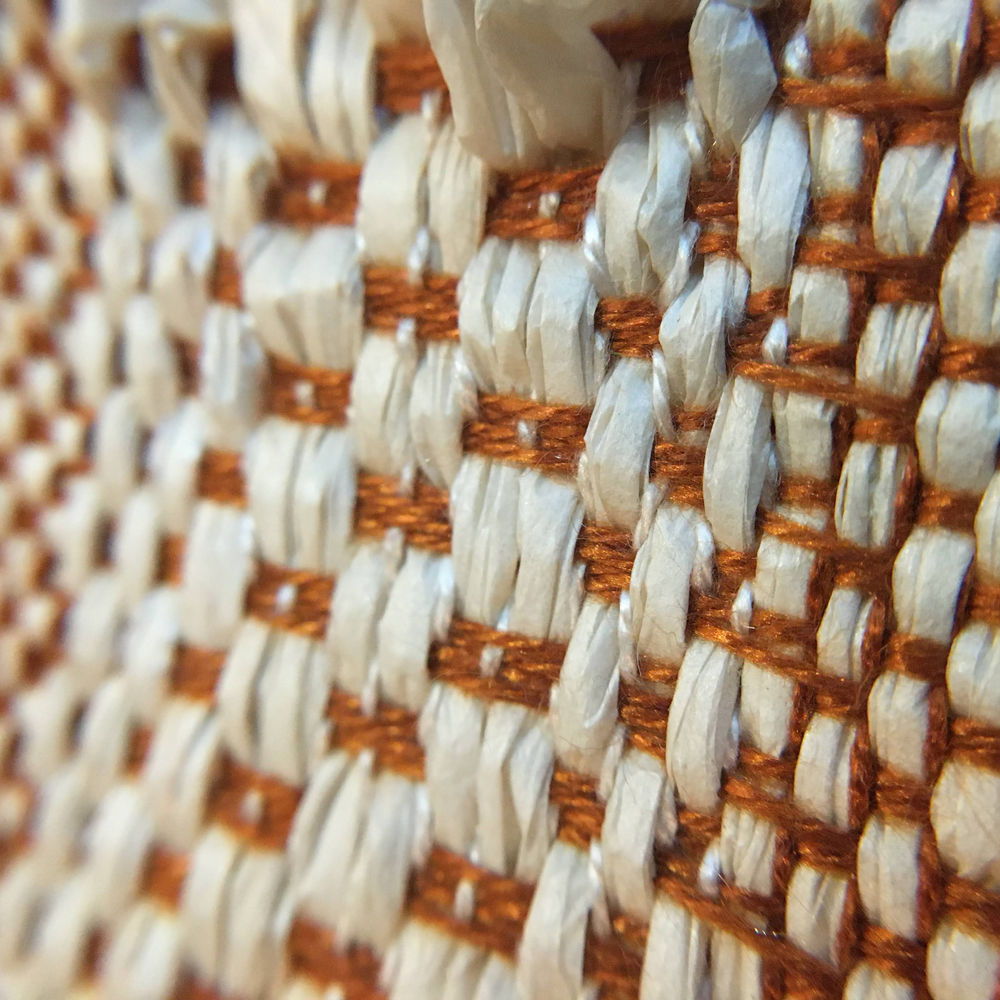

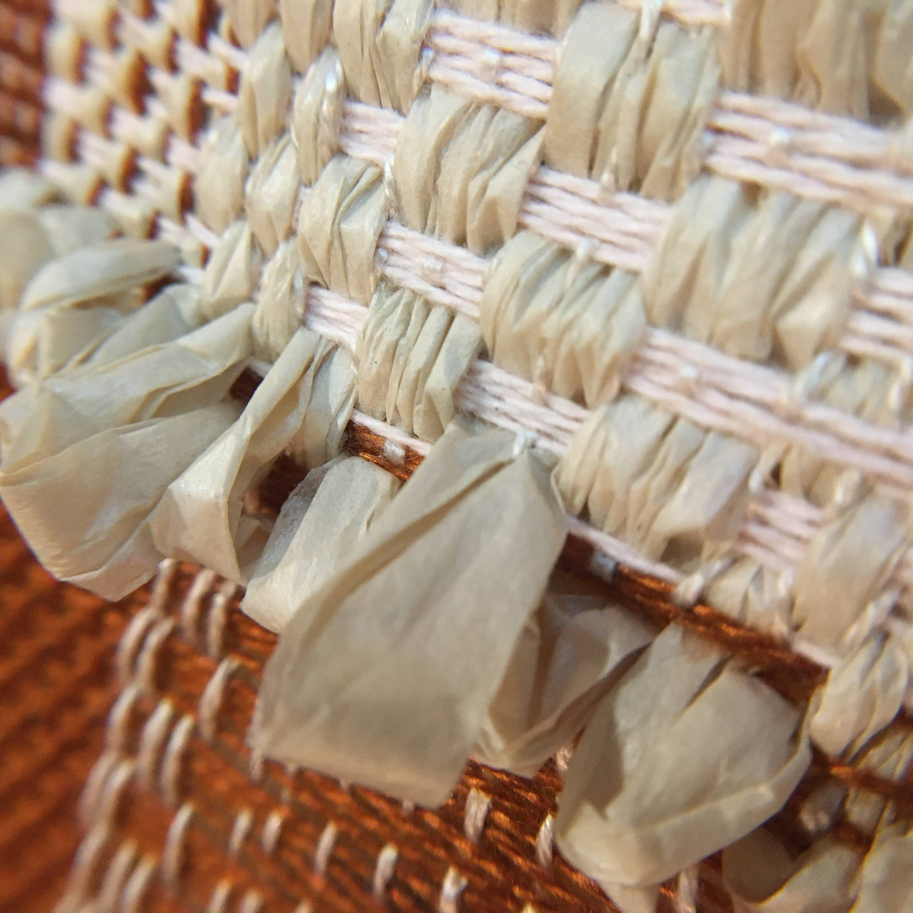

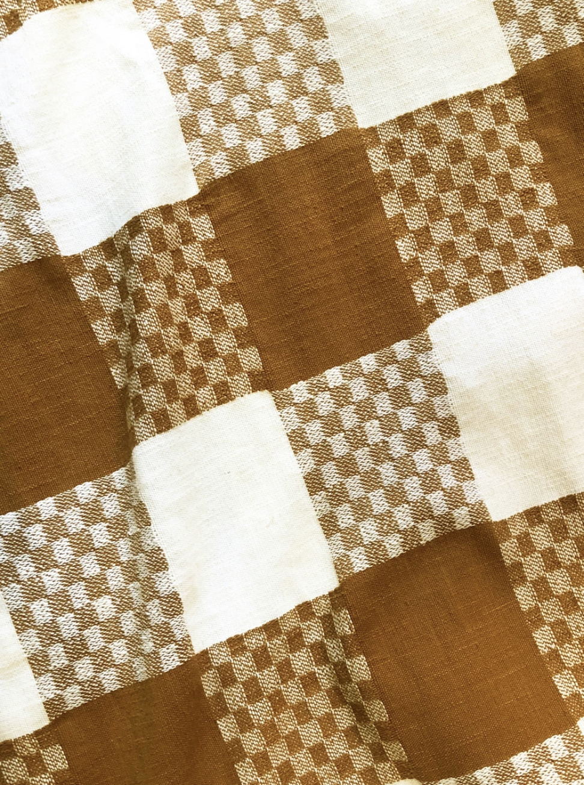

**Process Note 2:** With the idea that I should make it a more official piece, I decided to bind the bottom edge of the textile while its on the loom. I have applied a similar technique after weaving, but during weaving seemed to be a bit easier and I wanted to see how it might work. It took me a while to figure out the process, but then I found a technique that worked: see below:  

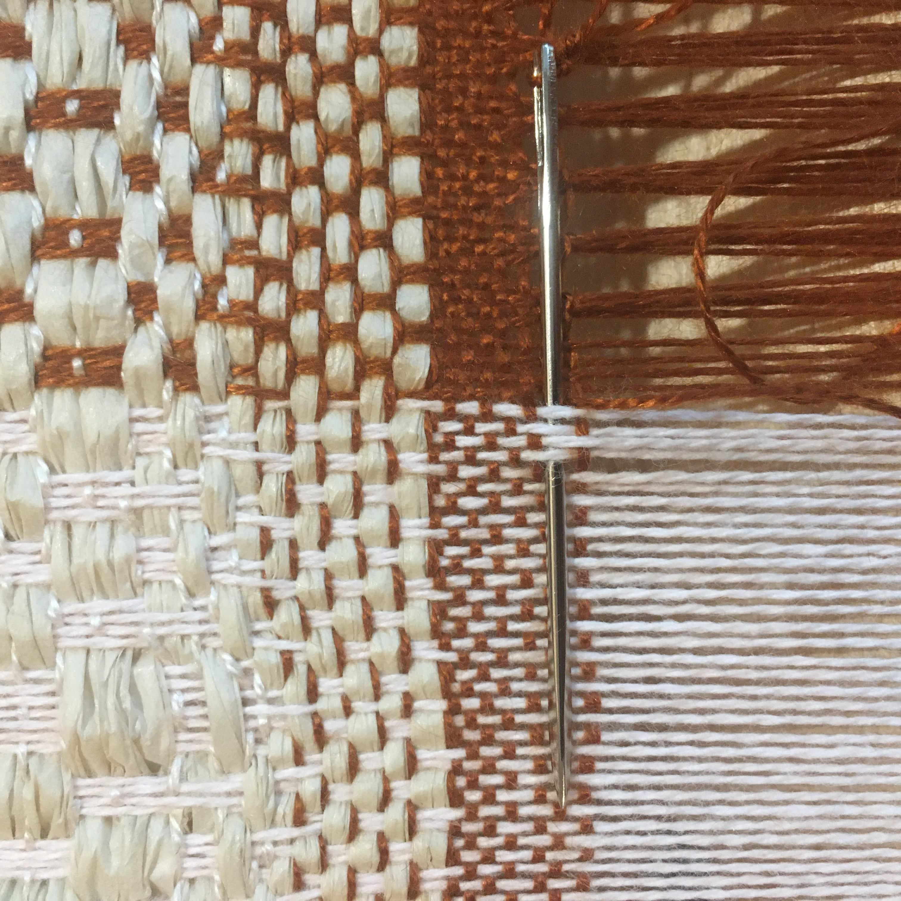

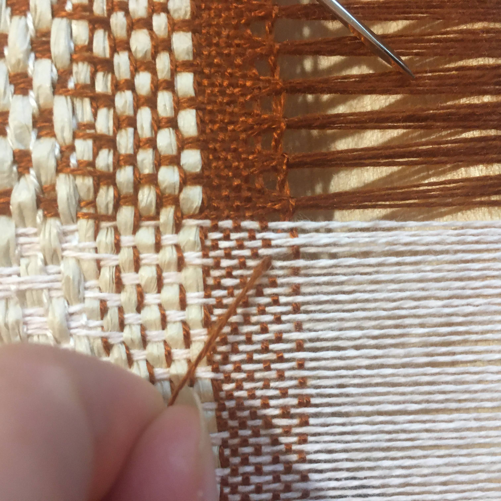

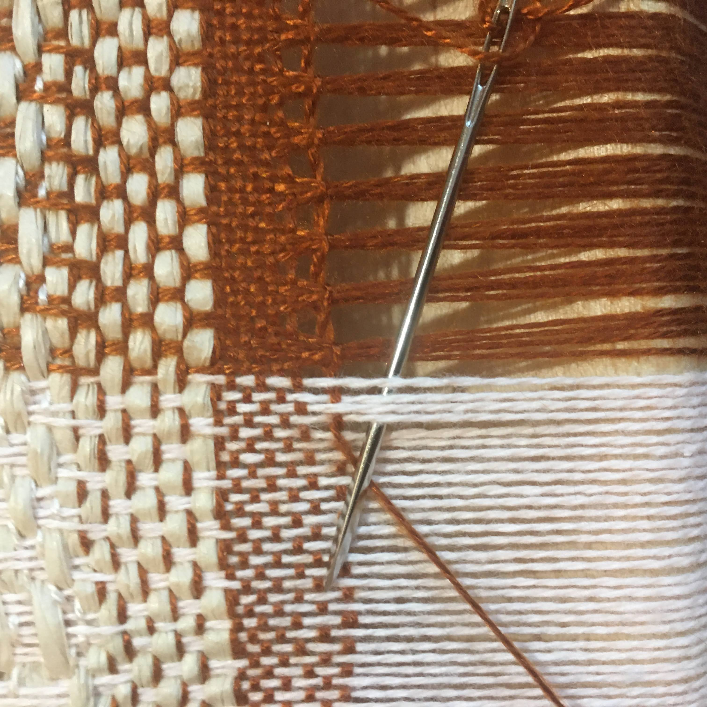

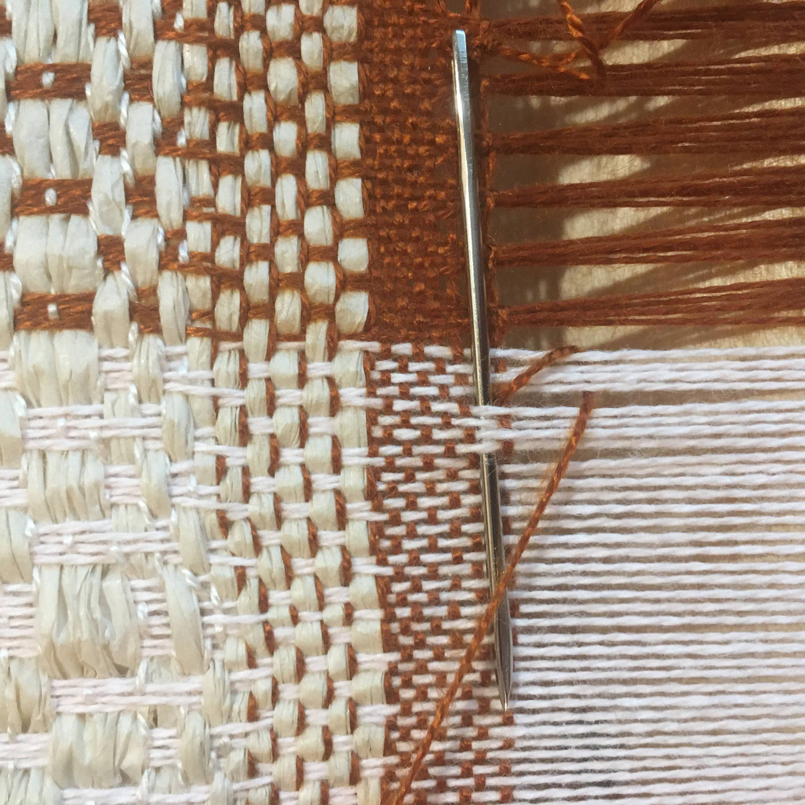

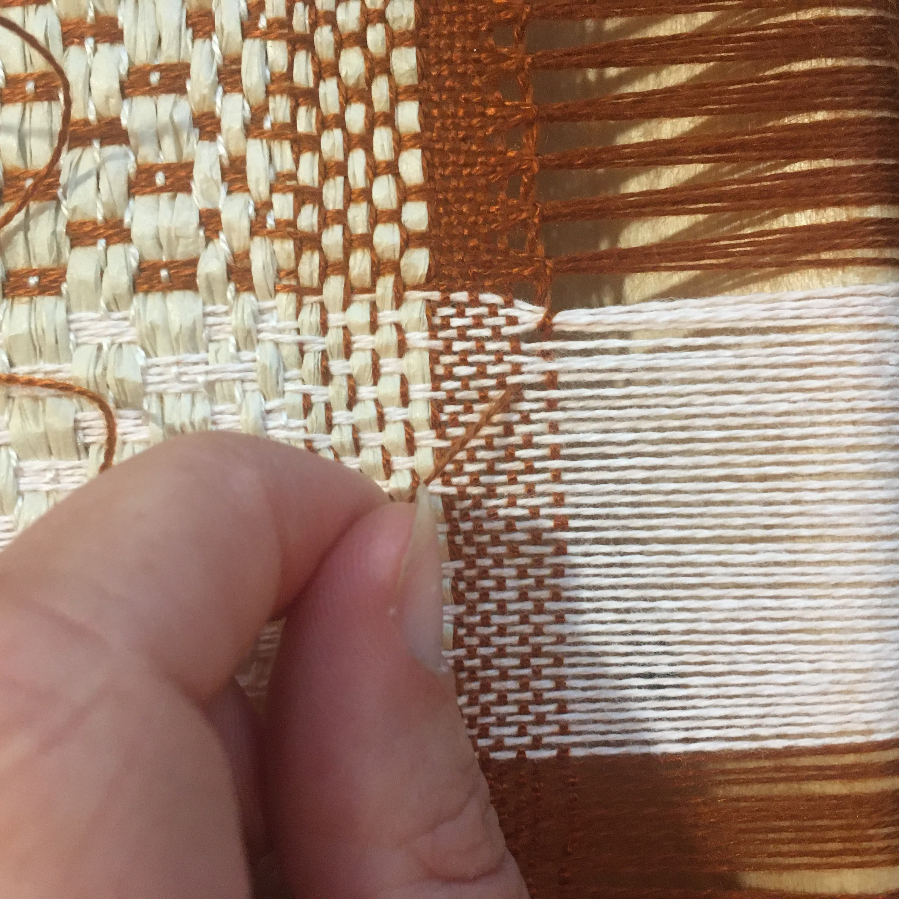

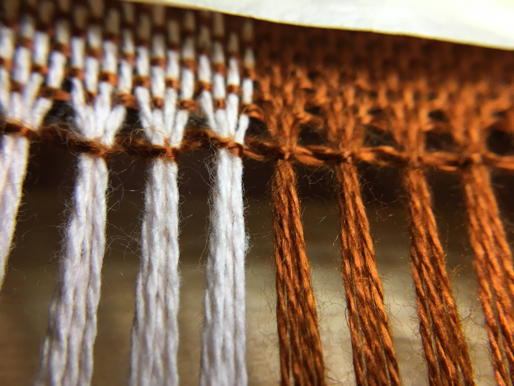

**Process Note 3:** Taking a step back and reflecting, I began to see the loopy ends of the paper being the most interesting. In the next steps, I played with this more:

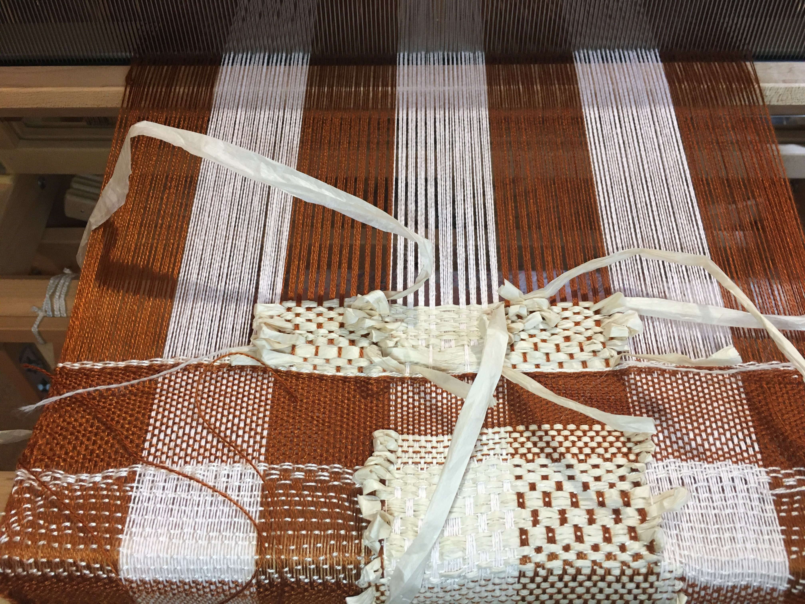

At first, I though I would create patterns by interlacing the loops and allowing them to travel in different directions. 

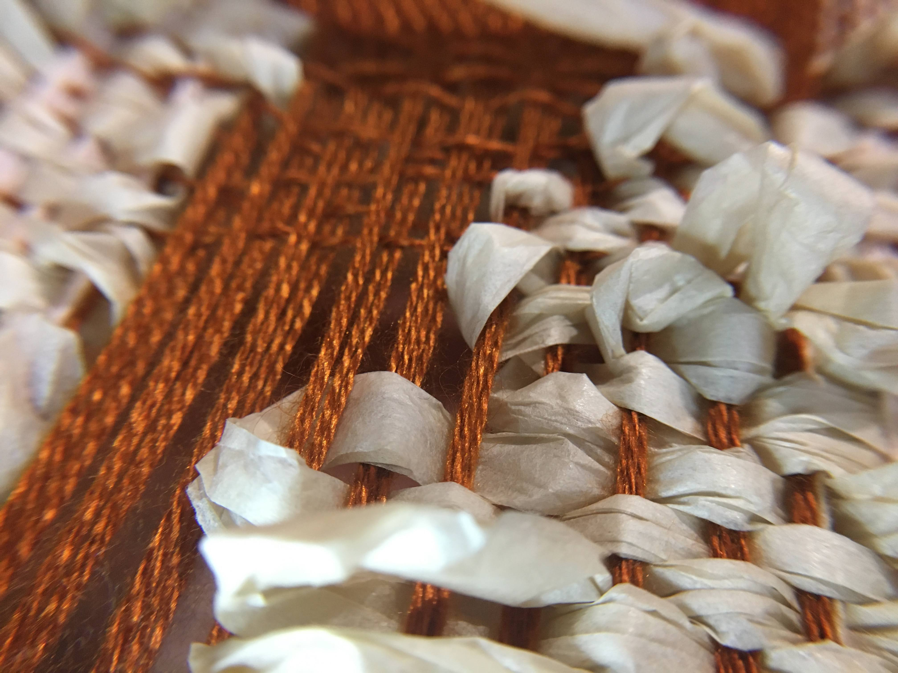

I then realized that the contrast between the looping paper and the brown warps created the most visual interest and I wanted to emphasize that by having more open regions of the brown. 

**Reflection:** The ideas I explored didn't lead to any magical insights, but I did find that the paper might work best when integrated into tapestry, as a kind of texture. I also enjoyed the sound of working with the paper, making me want to explore how it could be designed to produce sounds more intentionally, like associated with particular movements. Maybe an integrated speaker might further amplify the sound.  

